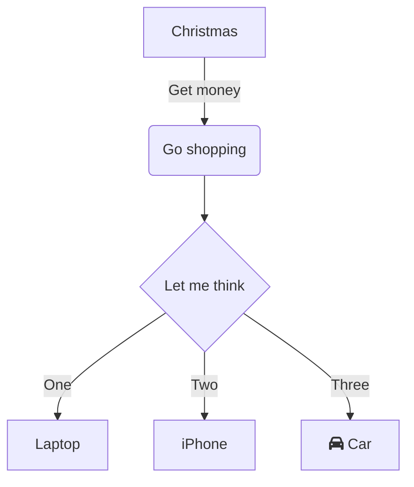

# SLA Management Prototype

## Objective: Give users a clear understanding of which SLAs apply to a Case, e.g. when deadlines are approaching, and what actions need to be taken.

### Task: Create a lightweight system that

- models SLAs
- applies them automatically

## Assumptions

- All Cases must meet SLAs (no Record Type or other criteria must be met)
- Resolution SLA starts from the time the Case was opened, NOT from the time the First Response SLA was satisfied
- Cases may be marked as "Resolved" without first completing the "First Response" SLA
  - Helps adhere to tighter prototype timeline
  - Covers the scenario where the customer reaches back out to cancel the request

# Data Model

- Account
  - Entitlement
    - SLA Policy
- Case
  - Account
  - Entitlement
    - SLA Policy

## Approach

- TODO: create Mermaid diagram that shows data model
  - Account
  - Case
  - CaseMilestone

- use the standard `Priority` picklist field on Case to determine SLA priority
- use standard `CustomerPriority__c` field on Account with a value of `VIP` to determine VIP status
- use standard `Status` field with added custom value `Responded`, which is used to determine the First Response SLA

- use OOTB Entitlements/Milestones/SLA features
  - Entitlement: `Standard Case`
    - Entitlement Assignment rule to always assign `Standard Case` Entitlement
  - Milestone: `First Response to Customer`
    - Flow: `First Response SLA Flow` marks the Milestone as complete when the Case is put into a `Responded` Status
  - Milestone: `Resolution`
    - Flow: `Resolution Time SLA Flow` marks the Milestone as complete when the Case is put into a `Resolved` Status
  - for both Milestones, check the `Enable Apex class for time trigger (minutes)` checkbox to use the custom calculation
    - Apex class: `FirstResponseMilestoneCalculator`
    - Apex class: `ResolutionMilestoneCalculator`
