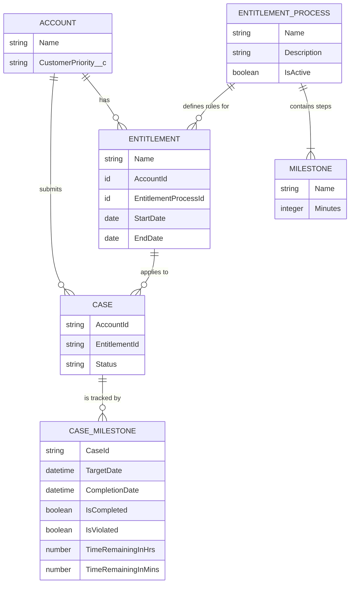

# SLA Management Prototype

## Objective: Give users a clear understanding of which SLAs apply to a Case, e.g. when deadlines are approaching, and what actions need to be taken.

### Task: Create a lightweight system that

- models SLAs
- applies them automatically

## Assumptions

- All Cases must meet SLAs (no Record Type or other criteria must be met)
- Resolution SLA starts from the time the Case was opened, NOT from the time the First Response SLA was satisfied
- Cases may be marked as "Resolved" without first completing the "First Response" SLA
  - Helps adhere to tighter prototype timeline
  - Covers the scenario where the customer reaches back out to cancel the request

# Data Model

## Approach

- use the standard `Priority` picklist field on Case to determine SLA priority
- use standard `CustomerPriority__c` field on Account with a value of `VIP` to determine VIP status
- use standard `Status` field on `Case` with added custom value `Responded`, which is used to determine the First Response SLA

- use OOTB Entitlements/Milestones/SLA features
  - Entitlement Process: `Standard Case Policy`
  - Entitlement: `Standard Case Entitlement`
    - Entitlement Assignment rule to always assign `Standard Case` Entitlement
      

  - Milestone: `First Response to Customer`
    - Flow: `First Response SLA Flow` marks the Milestone as complete when the Case is put into a `Responded` Status
  - Milestone: `Resolution`
    - Flow: `Resolution Time SLA Flow` marks the Milestone as complete when the Case is put into a `Resolved` Status
  - for both Milestones, the `Enable Apex class for time trigger (minutes)` checkbox is used to perform the custom calculation
    - Apex class: `FirstResponseMilestoneCalculator`
    - Apex class: `ResolutionMilestoneCalculator`
      

- display SLA Milestones on the Case within a custom `lightning-datatable`:
  - LWC: `slaDatatable`
  - defines a custom type within a `mileStoneStatusCell` LWC
    - displays color-coded badges based on the SLA milestone status
  - provides row-level action for each Milestone, allowing the user to mark them as completed
    

## Usage

Play the video below for an overview on using the system, or follow these high-level steps:

1. Create a new Case, leaving the `Entitlement Name` field blank, as it will be populated automatically via automation
2. Either select an existing Account, or create a new one (VIP status is denoted by the `Customer Priority` field)
3. If wanting to verify the `Status` badges change as time passes, press the `Refresh` button at the bottom of the component
4. Use the row-level actions at the far right of each row to mark a Milestone as complete. The table will auto-refresh upon doing so

https://github.com/user-attachments/assets/a90fea63-5b32-4320-b994-7aead74a2d76
